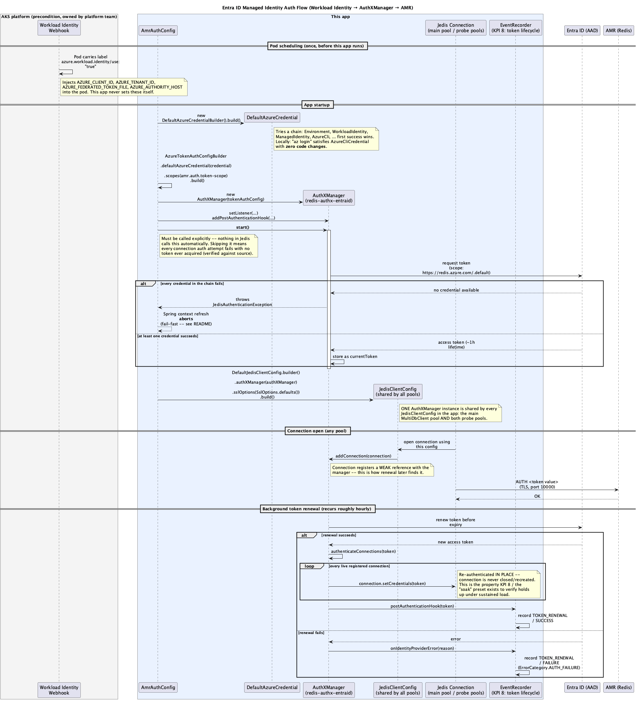
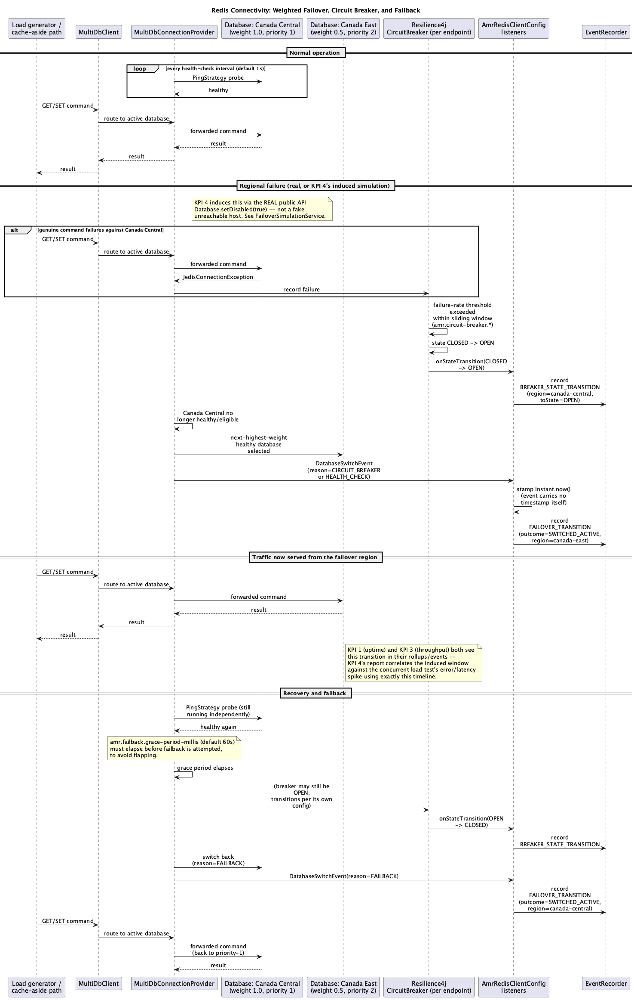
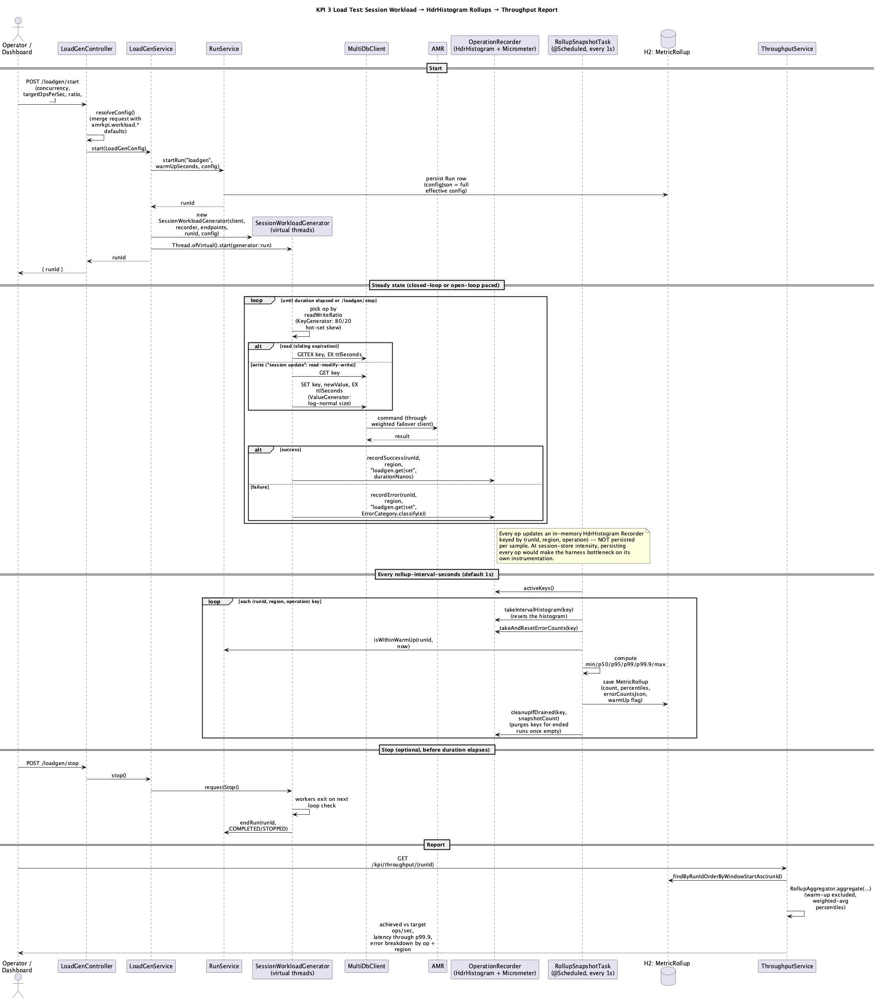
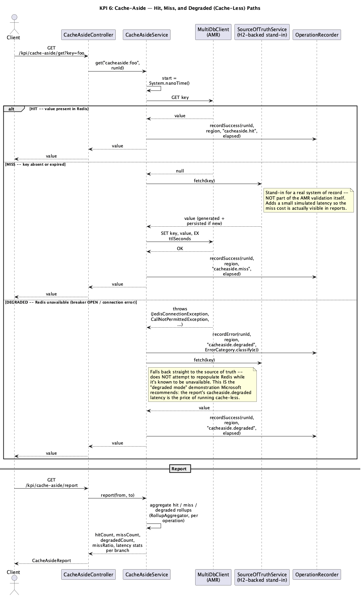

# Architecture — sequence diagrams

This folder documents the four flows that matter most for understanding how this harness
actually talks to Azure Managed Redis. Each diagram is generated from a PlantUML source file in
[`diagrams/`](diagrams/) — regenerate with `plantuml -tpng docs/diagrams/*.puml` after editing a
`.puml` file (see [Regenerating these diagrams](#regenerating-these-diagrams) below).

These diagrams are a companion to the main [README](../README.md), not a replacement for it — the
README's [Redis connectivity](../README.md#how-redis-connectivity-works) and
[managed identity](../README.md#how-entra-id-managed-identity-auth-works) sections explain the
same material in prose, with code references. Read the diagram alongside the code it depicts, not
instead of it.

## 1. Entra ID managed identity auth flow



**Source:** [`diagrams/auth-flow.puml`](diagrams/auth-flow.puml) · **Code:**
[`AmrAuthConfig.java`](../src/main/java/com/example/amrkpi/redis/AmrAuthConfig.java)

What this shows, in order:

1. **A precondition this app doesn't control**: the AKS workload-identity webhook injects four
   env vars into the pod at scheduling time, based on the ServiceAccount's federated credential
   and the `azure.workload.identity/use: "true"` pod label.
2. **Startup**: `DefaultAzureCredential` is built with zero explicit configuration — it's a chain
   of credential types, and whichever one succeeds first (workload identity in AKS, `az login`
   locally) is transparent to the rest of the app.
3. That credential is wrapped into an `AuthXManager` (from `redis-authx-entraid`), which is
   `.start()`ed explicitly — this call is not optional, and skipping it is a real failure mode
   the diagram calls out.
4. **The fail-fast branch**: if every credential in the chain fails, `AuthXManager.start()`
   throws and Spring's context refresh aborts before anything else in the app comes up. This is
   why a broken RBAC grant or missing federation shows up as a crash, not a degraded pod.
5. **One `AuthXManager`, every connection**: the same instance is wired into every
   `JedisClientConfig` in the app (main pool + both probe pools), and every `Connection` Jedis
   opens under that config registers itself with the manager.
6. **Background renewal**: this is the part KPI 8 exists to observe — token renewal
   re-authenticates already-open pooled connections in place, without closing them, and every
   renewal (success or failure) is recorded as a `TOKEN_RENEWAL` event.

## 2. Redis connectivity: weighted failover, circuit breaker, failback



**Source:** [`diagrams/redis-failover-flow.puml`](diagrams/redis-failover-flow.puml) · **Code:**
[`AmrRedisClientConfig.java`](../src/main/java/com/example/amrkpi/redis/AmrRedisClientConfig.java)

What this shows, in order:

1. **Normal operation**: independent health-check pings run against Canada Central regardless of
   command traffic; commands route through `MultiDbClient` → `MultiDbConnectionProvider` to
   whichever database is currently active (Canada Central, by weight, under normal conditions).
2. **A regional failure** (real, or KPI 4's `Database.setDisabled(true)` simulation) drives
   genuine command failures, which the per-endpoint Resilience4j circuit breaker counts against
   its configured failure-rate threshold and sliding window.
3. **The breaker trips OPEN**, which the app's own listener (registered in
   `AmrRedisClientConfig`) turns into a persisted `BREAKER_STATE_TRANSITION` event — this is the
   live state KPI 5 reports.
4. **The provider selects the next-highest-weight healthy database** (Canada East) and fires a
   `DatabaseSwitchEvent`, which the app timestamps itself (the event carries no timestamp of its
   own — verified against the Jedis source) and records as a `FAILOVER_TRANSITION` — this is what
   KPI 4's report correlates against the concurrent load test's rollups.
5. **Recovery and failback**: health checks against Canada Central keep running independently
   throughout the outage. Once it's healthy again, the configured grace period
   (`amr.failback.grace-period-millis`) must elapse before the client switches back — this
   prevents flapping on a flaky recovery.

## 3. KPI 3 load test: session workload → rollups → report



**Source:** [`diagrams/load-test-metrics-flow.puml`](diagrams/load-test-metrics-flow.puml) ·
**Code:**
[`SessionWorkloadGenerator.java`](../src/main/java/com/example/amrkpi/loadgen/SessionWorkloadGenerator.java),
[`RollupSnapshotTask.java`](../src/main/java/com/example/amrkpi/metrics/RollupSnapshotTask.java)

What this shows, in order:

1. **Start**: the requested config is merged with `amrkpi.workload.*` defaults, a `Run` row is
   persisted with the full effective configuration, and the actual load generation runs on its
   own virtual thread so the HTTP request returns immediately with a `runId`.
2. **Steady state**: each operation (GET for reads with sliding-expiration `GETEX`, or a
   read-modify-write for the "session update" write path) goes through the same `MultiDbClient`
   documented in diagram 2 above — so a load test's traffic experiences the exact same weighted
   failover/breaker/health-check behavior real application traffic would.
3. **Every operation updates an in-memory HdrHistogram** via `OperationRecorder` — nothing is
   persisted per-sample. This is deliberate: at session-store intensity (tens of thousands of
   ops/sec), persisting every sample would make the harness bottleneck on its own instrumentation.
4. **Once a second**, `RollupSnapshotTask` drains every active histogram, computes percentiles,
   and persists one `MetricRollup` row per (run, region, operation) — this is the only thing
   reports and charts are ever built from.
5. **The report** (`GET /kpi/throughput/{runId}`) reads those rollups back through
   `RollupAggregator`, which excludes warm-up windows and computes count-weighted-average
   percentiles across them.

## 4. KPI 6 cache-aside: hit, miss, and degraded paths



**Source:** [`diagrams/cache-aside-flow.puml`](diagrams/cache-aside-flow.puml) · **Code:**
[`CacheAsideService.java`](../src/main/java/com/example/amrkpi/kpi/cachemiss/CacheAsideService.java)

What this shows, in order:

1. **Hit**: a GET against Redis returns a value directly — no source-of-truth involvement at all.
2. **Miss**: a null result triggers a fetch from `SourceOfTruthService` (an H2-backed stand-in for
   whatever real system of record would sit behind the cache in production — explicitly not part
   of the AMR validation itself), then populates Redis with the configured TTL before returning.
3. **Degraded**: if the GET itself throws (breaker OPEN, connection failure, ...), the service
   falls back straight to the source of truth **without** attempting to write back to Redis while
   it's known to be unavailable. This third branch is the actual point of KPI 6 beyond a simple
   hit/miss counter — it's the "what does cache-less cost" demonstration, and its latency numbers
   are reported completely separately from hit/miss latency so the price of degraded mode is
   never averaged away.

## Regenerating these diagrams

```bash
brew install plantuml   # one-time; pulls in openjdk + graphviz as needed
cd docs/diagrams
plantuml -tpng *.puml
```

Each `.puml` file renders to a same-named `.png` in this folder — commit the regenerated PNGs
alongside any `.puml` edit so the images in this doc and the README stay in sync with the source.
